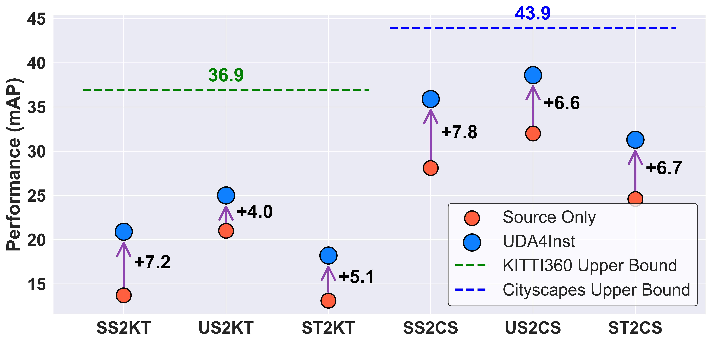
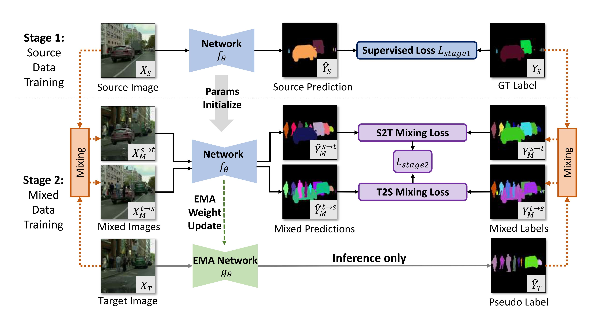

**[UDA4Inst: Unsupervised Domain Adaptation for Instance Segmentation]([论文PDF链接](https://arxiv.org/pdf/2405.09682))**  
*Yachan Guo, Yi Xiao, Danna Xue, Jose Luis Gomez Zurita, Antonio M López*  
**	Accepted at IEEE Intelligent Vehicles Symposium (IV 2025) as an oral presentation**, 2025  
✅ [Project Page](https://github.com/gyc-code/UDA4Inst) | 📄 [PDF](https://arxiv.org/pdf/2405.09682) | ✨ [DOI](...)  


<center>

<center>
  
# Architecture
<center>

<center>
  
<div align="center">

<br>
<em>uda4inst pipeline</em>
</div>

  
<center>

<center>


### Features

* A UDA architecture for instance segmentation from synthetic domain to real domain.
* Support synthetic and real domain segmentation datasets: Urbansyn, Synscapes, SYNTHIA, Cityscapes, KITTI360.

## Installation

See [installation instructions](INSTALL.md).

## Getting Started
### Train
bash train_net.sh


## Model Zoo and Baselines

We provide a large set of baseline results and trained models available for download in the [Mask2Former Model Zoo](MODEL_ZOO.md).

## License

Code is largely based on Mask2Former.
Shield: [](https://opensource.org/licenses/MIT)
The majority of Mask2Former is licensed under a [MIT License](LICENSE).

# Research Foundation
This repository is the official implementation of:  


## BibTeX
```bibtex
@article{guo2024uda4inst,
  title={UDA4Inst: Unsupervised Domain Adaptation for Instance Segmentation},
  author={Guo, Yachan and Xiao, Yi and Xue, Danna and Zurita, Jose Luis Gomez and L{\'o}pez, Antonio M},
  journal={arXiv preprint arXiv:2405.09682},
  year={2024}
}

## Acknowledgement

Code is largely based on Mask2Former (https://github.com/facebookresearch/Mask2Former).
